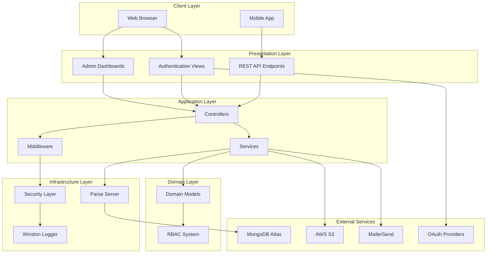
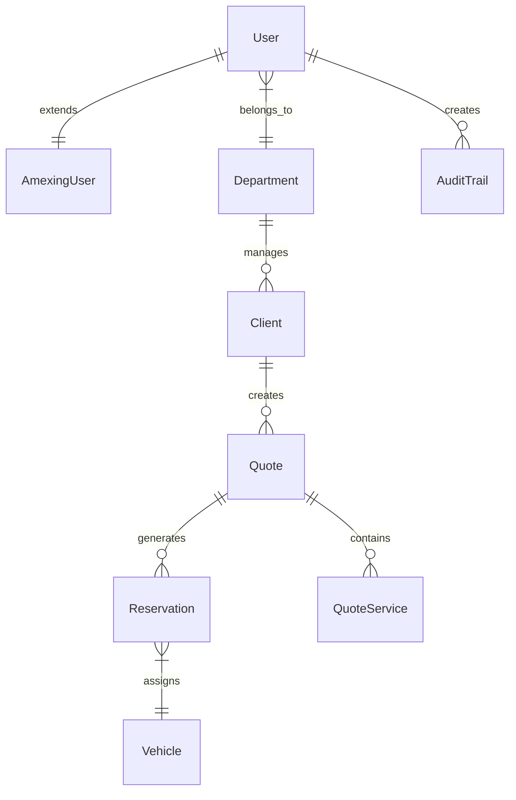
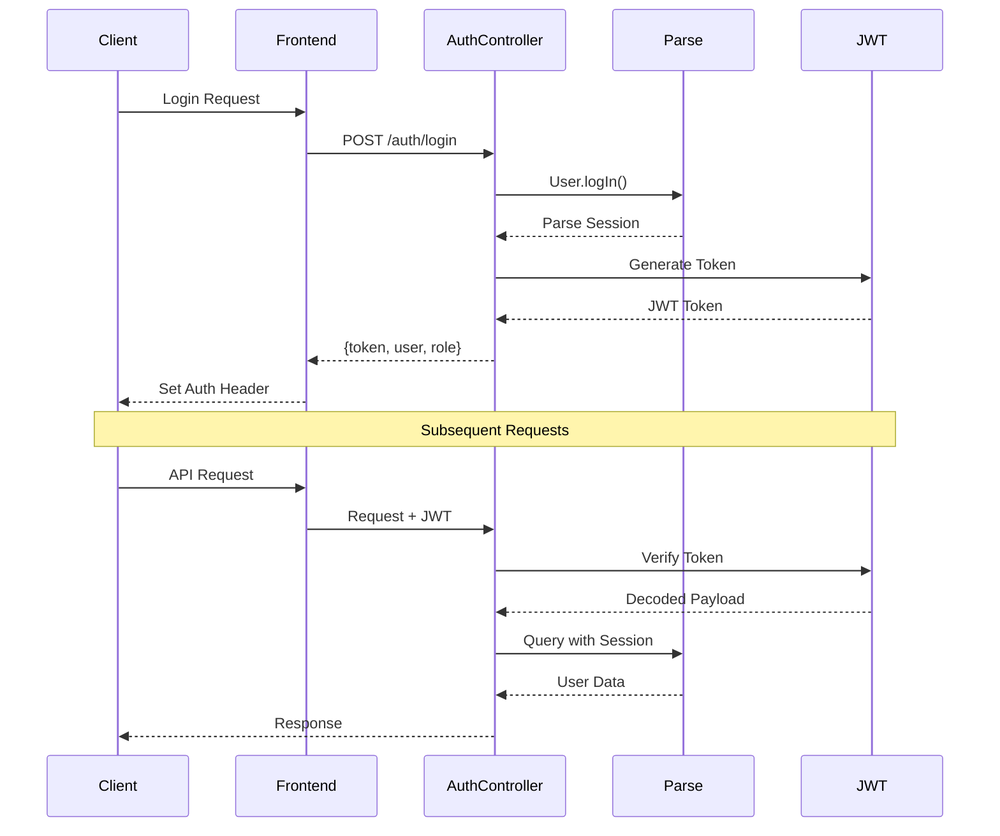
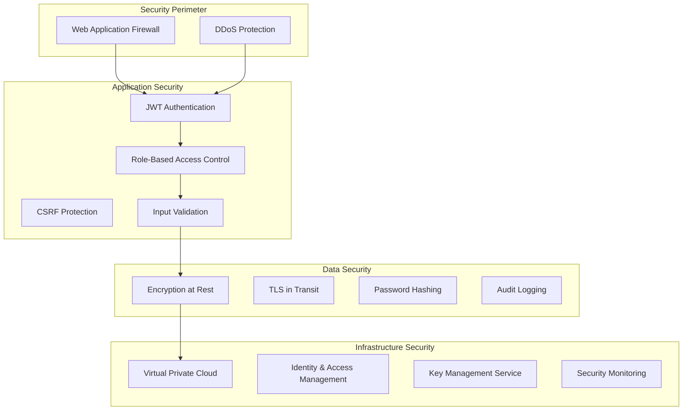
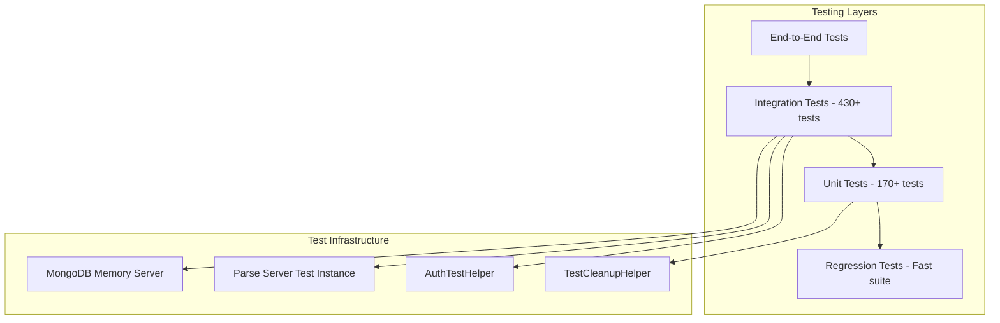

# Amexing Experience - System Architecture Documentation

## Overview

AmexingWeb is a **PCI DSS 4.0 compliant e-commerce platform** built with Parse Server, Node.js, and MongoDB. The system follows **Clean Architecture principles** with comprehensive **Role-Based Access Control (RBAC)** and extensive security measures.

**Core Technologies:**
- **Backend**: Parse Server (BaaS), Node.js, Express.js
- **Database**: MongoDB with Parse Server ORM
- **Frontend**: EJS Templates with Atomic Design
- **Authentication**: JWT with OAuth 2.0 (Apple, Corporate)
- **Infrastructure**: AWS S3, MailerSend, Winston Logging

---

## High-Level Architecture



---

## Clean Architecture Structure

### **Presentation Layer** (`src/presentation/`)

**Responsibility**: User interface and HTTP routing

```
src/presentation/
├── routes/                    # Express route definitions
│   ├── api/                  # REST API routes
│   ├── auth/                 # Authentication routes  
│   └── dashboard/            # Dashboard routes
└── views/                    # EJS templates (Atomic Design)
    ├── atoms/                # Basic UI elements
    ├── molecules/            # Component combinations
    ├── organisms/            # Complex components
    ├── templates/            # Page layouts
    └── dashboards/           # Role-based dashboards
```

**Key Patterns:**
- **Atomic Design**: atoms → molecules → organisms → templates → pages
- **Role-Based Views**: 8 different dashboard types per role
- **Component Showcase**: Development and documentation system at `/atomic`

### **Application Layer** (`src/application/`)

**Responsibility**: Business logic orchestration and HTTP handling

```
src/application/
├── controllers/              # HTTP request handlers
│   ├── api/                 # REST API controllers (47 controllers)
│   ├── auth/                # Authentication controllers
│   └── dashboard/           # Dashboard controllers
├── middleware/              # Application middleware
│   ├── auth/                # Authentication middleware
│   ├── validation/          # Input validation
│   └── error/               # Error handling
└── services/                # Business logic services
    ├── AuthenticationService.js
    ├── PermissionService.js
    └── BulkImportService.js
```

**Key Controllers:**
- **QuoteController**: Core business functionality
- **ReservationController**: Booking management  
- **BillingController**: Payment processing (PCI DSS compliant)
- **UserManagementController**: RBAC administration
- **ExperienceController**: Tour and service management

### **Domain Layer** (`src/domain/`)

**Responsibility**: Core business entities and rules

```
src/domain/
└── models/                   # Domain entities
    ├── AmexingUser.js       # User entity with RBAC
    ├── Client.js            # Client management
    ├── Department.js        # Organizational structure
    ├── Quote.js             # Core business entity
    ├── Reservation.js       # Booking entity
    └── Vehicle.js           # Fleet management
```

**Domain Rules:**
- **Logical Deletion**: `exists: false` (never physical delete)
- **Activation State**: `active: true/false` for temporary disable
- **Email Uniqueness**: Enforced across all entry points
- **RBAC Integration**: All entities respect role permissions

### **Infrastructure Layer** (`src/infrastructure/`)

**Responsibility**: External concerns and technical implementation

```
src/infrastructure/
├── logger.js                # Winston logging configuration
├── secrets/                 # Secret management
│   └── secretsManager.js    # Environment-based secrets
└── security/                # Security implementations
    ├── pciDssCompliance.js  # PCI DSS Level 1 compliance
    ├── csrfProtection.js    # CSRF token management
    └── jwtMiddleware.js     # JWT authentication
```

**Security Features:**
- **PCI DSS Level 1 Compliance**: Credit card data protection
- **JWT Authentication**: Stateless authentication with refresh
- **CSRF Protection**: Token-based request validation
- **Input Validation**: Comprehensive sanitization
- **Audit Logging**: All security events logged

---

## Data Architecture

### **Database Schema** (MongoDB via Parse Server)

**Standard Fields** (All tables):
```javascript
{
  active: Boolean,     // true = active, false = inactive
  exists: Boolean,     // true = visible, false = logically deleted
  createdAt: Date,     // Auto-managed by Parse Server
  updatedAt: Date,     // Auto-managed by Parse Server
  objectId: String     // Primary key (Parse Server)
}
```

**Key Collections:**

| Collection | Purpose | Key Fields |
|------------|---------|------------|
| _User | Parse Server users with RBAC | email, role, department |
| AmexingUser | Extended user profiles | profile data, preferences |
| Client | Customer management | contact info, agency type |
| Quote | Core business entity | pricing, services, status |
| Reservation | Booking management | dates, vehicles, status |
| Department | Organizational structure | name, manager, settings |
| Vehicle | Fleet management | capacity, features, images |

### **Data Relationships**



**Relationship Patterns:**
- **User Extension**: _User → AmexingUser (1:1)
- **Departmental Hierarchy**: Department → Users → Clients (1:N:N)
- **Business Flow**: Client → Quote → Reservation (1:N:N)
- **Resource Management**: Vehicle allocation and availability
- **Audit Trail**: Complete action logging for compliance

---

## Authentication & Authorization Architecture

### **JWT Authentication Flow**



### **Role-Based Access Control (RBAC)**

**8 System Roles** (Hierarchical):

| Role | Level | Description | Access |
|------|-------|-------------|--------|
| **superadmin** | 8 | System administrator | All permissions |
| **admin** | 7 | Platform administrator | Most permissions |
| **department_manager** | 6 | Department head | Department scope |
| **employee** | 5 | Regular employee | Limited operations |
| **employee_amexing** | 4 | Amexing employee | Internal operations |
| **driver** | 3 | Vehicle operator | Driver-specific |
| **client** | 2 | Customer | Client portal |
| **guest** | 1 | Visitor | Read-only access |

**30 System Permissions** (Categorized):

```javascript
// User Management
USER_CREATE, USER_READ, USER_UPDATE, USER_DELETE,
USER_ACTIVATE, USER_DEACTIVATE,

// Client Management  
CLIENT_CREATE, CLIENT_READ, CLIENT_UPDATE, CLIENT_DELETE,
CLIENT_ASSIGN, CLIENT_TRANSFER,

// Quote Management
QUOTE_CREATE, QUOTE_READ, QUOTE_UPDATE, QUOTE_DELETE,
QUOTE_APPROVE, QUOTE_CONVERT,

// Reservation Management
RESERVATION_CREATE, RESERVATION_READ, RESERVATION_UPDATE, 
RESERVATION_DELETE, RESERVATION_CONFIRM, RESERVATION_CANCEL,

// System Administration
ADMIN_PANEL, SYSTEM_SETTINGS, AUDIT_LOGS,
DEPARTMENT_MANAGE, ROLE_ASSIGN, PERMISSION_MANAGE
```

**Permission Matrix**: See [PERMISSIONS-MATRIX.md](maps/PERMISSIONS-MATRIX.md) for complete mapping.

### **OAuth 2.0 Integration**

**Supported Providers:**
- **Apple Sign-In**: iOS/macOS native integration
- **Corporate SSO**: Enterprise authentication
- **Username/Password**: Traditional authentication

**OAuth Flow:**
1. **Client Initiation**: Redirect to provider
2. **Provider Authentication**: User authenticates
3. **Callback Handling**: Receive authorization code
4. **Token Exchange**: Code for access token
5. **User Creation**: Create/update Parse User
6. **JWT Generation**: Internal session management

---

## API Architecture

### **REST API Design** (47 Controllers)

**Base URL Structure:**
```
/api/{resource}/{action}
/api/v1/{resource}/{id}
/dashboard/{role}/{resource}
```

**High-Priority Controllers:**

| Controller | Purpose | Risk Level | Dependencies |
|------------|---------|------------|--------------|
| **AuthController** | Authentication | Critical | Parse User, JWT |
| **QuoteController** | Core business | High | Reservation, Billing |
| **ReservationController** | Bookings | High | Vehicle, Employee |
| **BillingController** | Payments | High | Invoice, Payment |
| **UserManagementController** | RBAC | High | AmexingUser, Roles |

**API Response Format:**
```javascript
// Success Response
{
  success: true,
  data: {
    // Response data
  },
  timestamp: "2026-05-06T10:00:00Z"
}

// Error Response  
{
  success: false,
  error: "Human-readable message",
  code: "ERROR_CODE",
  timestamp: "2026-05-06T10:00:00Z"
}
```

### **Error Handling Strategy**

**Error Categories:**
- **Validation Errors** (400): Input validation failures
- **Authentication Errors** (401): Invalid credentials/tokens
- **Authorization Errors** (403): Insufficient permissions  
- **Not Found Errors** (404): Resource not found
- **Server Errors** (500): Internal system errors

**Error Logging** (PCI DSS Compliant):
```javascript
// Security Event Logging
logger.security('Auth failed', {
  userId: user?.id,
  ip: req.ip,
  userAgent: req.get('User-Agent'),
  timestamp: new Date().toISOString()
});

// Data Access Logging  
logger.audit('Data accessed', {
  userId: user.id,
  resource: 'Client',
  action: 'READ',
  resourceId: client.id
});
```

---

## Frontend Architecture

### **Atomic Design Implementation**

**Component Hierarchy:**
```
Views (EJS Templates)
├── Atoms (Basic elements)
│   ├── buttons/, inputs/, icons/
│   └── Common, dashboard, auth variants
├── Molecules (Component groups)  
│   ├── forms/, navigation/, cards/
│   └── Context-specific combinations
├── Organisms (Complex components)
│   ├── headers/, sidebars/, tables/
│   └── Full feature sections
└── Templates (Page layouts)
    ├── dashboard layouts/
    └── Role-specific structures
```

**Component Showcase System:**
- **Development Tool**: Live component preview
- **Documentation**: Usage examples and parameters
- **Access**: `http://localhost:1337/atomic`
- **Categories**: `/dashboard`, `/auth`, `/common`

### **Role-Based Dashboard System**

**8 Dashboard Types:**

| Role | Dashboard URL | Features |
|------|---------------|----------|
| SuperAdmin | `/dashboard/superadmin` | Full system control |
| Admin | `/dashboard/admin` | Platform management |
| Department Manager | `/dashboard/department_manager` | Department scope |
| Employee | `/dashboard/employee` | Daily operations |
| Employee Amexing | `/dashboard/employee_amexing` | Internal tasks |
| Driver | `/dashboard/driver` | Route management |
| Client | `/dashboard/client` | Client portal |
| Guest | `/dashboard/guest` | Limited view |

**Dashboard Components:**
- **Navigation**: Role-specific menu items
- **Widgets**: Permission-based feature access
- **Data Tables**: Filtered data per role scope
- **Actions**: Available operations per permission

---

## Security Architecture

### **PCI DSS Level 1 Compliance**

**Implementation Areas:**

| Requirement | Implementation | Status |
|-------------|----------------|--------|
| **Network Security** | Firewall, VPN, Segmentation | ✅ |
| **Data Protection** | Encryption at rest/transit | ✅ |
| **Access Control** | RBAC, Multi-factor auth | ✅ |
| **Monitoring** | Audit logs, real-time alerts | ✅ |
| **Vulnerability Management** | Regular scans, patching | ✅ |
| **Security Testing** | Penetration testing, code review | ✅ |

**Security Layers:**



### **Audit Trail System**

**Logged Events:**
- **Authentication**: Login/logout, failed attempts
- **Data Access**: Create, read, update, delete operations
- **Permission Changes**: Role assignments, permission updates
- **System Events**: Configuration changes, errors
- **Payment Events**: All payment-related activities (PCI DSS)

**Log Format** (Winston):
```javascript
{
  timestamp: "2026-05-06T10:00:00Z",
  level: "info|warn|error|security|audit",
  message: "Human-readable description",
  userId: "user_object_id",
  action: "CREATE|READ|UPDATE|DELETE",
  resource: "User|Client|Quote|Reservation",
  resourceId: "resource_object_id",
  ip: "client_ip_address",
  userAgent: "browser_user_agent",
  sessionId: "parse_session_token"
}
```

---

## Performance Architecture

### **Caching Strategy**

**Caching Layers:**
1. **Parse Server Cache**: Object query results
2. **Application Cache**: Computed values, sessions
3. **CDN Cache**: Static assets (S3 + CloudFront)
4. **Browser Cache**: Client-side caching

**Cache Invalidation:**
- **Time-based**: TTL for different data types
- **Event-based**: Invalidation on data changes
- **Manual**: Admin cache clearing

### **Database Optimization**

**Indexing Strategy:**
```javascript
// Performance-critical indexes
db.User.createIndex({ email: 1 }, { unique: true })
db.Quote.createIndex({ clientId: 1, status: 1 })
db.Reservation.createIndex({ date: 1, status: 1 })
db.AuditTrail.createIndex({ timestamp: -1, userId: 1 })
```

**Query Optimization:**
- **Parse Queries**: Efficient query patterns
- **Compound Indexes**: Multi-field optimization
- **Query Monitoring**: Slow query identification
- **Connection Pooling**: MongoDB connection management

### **Scalability Patterns**

**Horizontal Scaling:**
- **Parse Server**: Multiple instances behind load balancer
- **MongoDB**: Replica sets and sharding
- **Session Management**: Stateless JWT tokens
- **File Storage**: Distributed S3 storage

**Monitoring Metrics:**
- **Response Times**: API endpoint performance
- **Error Rates**: Success/failure ratios  
- **Resource Usage**: CPU, memory, database
- **User Activity**: Concurrent users, peak loads

---

## Deployment Architecture

### **Environment Structure**

| Environment | Purpose | Database | URL |
|-------------|---------|----------|-----|
| **Development** | Local development | AmexingDEV | :1337 |
| **Test** | Integration testing | MongoDB Memory | :1339 |
| **Staging** | Pre-production | AmexingSTAGE | :1338 |
| **Production** | Live system | AmexingPROD | HTTPS |

### **Configuration Management**

**Environment Variables** (50+ variables):

| Category | Variables | Purpose |
|----------|-----------|---------|
| **Parse Server** | APP_ID, MASTER_KEY, SERVER_URL | Core configuration |
| **Database** | DATABASE_URI, DB_OPTIONS | MongoDB connection |
| **Authentication** | JWT_SECRET, OAUTH_CONFIG | Security keys |
| **External Services** | AWS_*, MAILER_*, OAUTH_* | Service integration |
| **Feature Flags** | ENABLE_*, DEBUG_* | Feature toggles |

**Secret Management:**
- **Development**: `.env.development` (local only)
- **Production**: Environment variables (container/cloud)
- **Rotation**: Quarterly key rotation (PCI DSS)
- **Access Control**: Principle of least privilege

### **Health Monitoring**

**Health Endpoints:**
```javascript
GET /health          // Basic health check
GET /metrics         // Detailed system metrics  
GET /health/database // Database connectivity
GET /health/external // External service status
```

**Monitoring Integration:**
- **Parse Server Health**: Connection status, performance
- **Database Health**: Connection pool, query performance  
- **External Services**: S3, MailerSend, OAuth availability
- **Application Health**: Memory usage, error rates

---

## Integration Architecture

### **External Service Integration**

**Critical External Dependencies:**

| Service | Purpose | Risk Level | Fallback Strategy |
|---------|---------|------------|-------------------|
| **MongoDB Atlas** | Primary database | Critical | Local MongoDB, backup |
| **AWS S3** | File storage | High | Local storage, retry |
| **MailerSend** | Email delivery | Medium | SMTP fallback |
| **OAuth Providers** | Authentication | Medium | Username/password |

**Integration Patterns:**
- **Circuit Breaker**: Prevent cascade failures
- **Retry Logic**: Exponential backoff
- **Timeout Management**: Service-specific timeouts
- **Health Checks**: Continuous availability monitoring

### **API Integration Security**

**Security Measures:**
- **API Keys**: Secure key management
- **Rate Limiting**: Prevent abuse
- **Request Signing**: HMAC verification  
- **Network Security**: VPC, firewalls
- **Audit Logging**: All external API calls

---

## Development Architecture

### **Testing Strategy** (600+ tests, 94%+ coverage)

**Testing Pyramid:**



**Testing Tools:**
- **Integration Tests**: MongoDB Memory Server (port 1339)
- **Unit Tests**: Jest with comprehensive mocking
- **Regression Tests**: Fast smoke test suite (<10s)
- **Continuous Monitoring**: Automated test monitoring

**Test-Driven Development (TDD):**
1. **🔴 RED**: Write failing test first
2. **🟢 GREEN**: Implement minimum code to pass
3. **🔵 REFACTOR**: Improve code quality

### **Quality Assurance**

**Quality Gates:**
- **Pre-commit**: ESLint, Semgrep, secret scanning
- **Pre-push**: Full test suite, security audit
- **CI/CD**: Automated testing, deployment validation
- **Manual Review**: Code review, security review

**Code Quality Metrics:**
- **Test Coverage**: Minimum 80%, target 94%+
- **Code Quality**: ESLint rules, Prettier formatting
- **Security**: Semgrep static analysis, vulnerability scanning
- **Performance**: Response time monitoring, load testing

---

## Maintenance & Operations

### **Monitoring & Alerting**

**System Monitoring:**
- **Application Performance**: Response times, error rates
- **Infrastructure**: CPU, memory, disk usage
- **Database**: Query performance, connection health
- **Security**: Failed login attempts, suspicious activity

**Alert Categories:**
- **Critical**: System down, security breach
- **High**: Performance degradation, service errors  
- **Medium**: Resource warnings, unusual activity
- **Low**: Maintenance reminders, updates available

### **Backup & Recovery**

**Backup Strategy:**
- **Database**: Daily automated backups
- **Files**: S3 versioning and cross-region replication
- **Configuration**: Version-controlled infrastructure
- **Code**: Git repository with multiple remotes

**Disaster Recovery:**
- **RTO** (Recovery Time Objective): 4 hours
- **RPO** (Recovery Point Objective): 1 hour
- **Failover**: Automated failover procedures
- **Testing**: Quarterly disaster recovery testing

### **Maintenance Procedures**

**Regular Maintenance:**
- **Database**: Index optimization, query analysis
- **Security**: Vulnerability scanning, patch management
- **Performance**: Cache optimization, resource scaling
- **Monitoring**: Log rotation, metric cleanup

**Update Procedures:**
- **Dependencies**: Monthly security updates
- **Platform**: Quarterly platform updates
- **Features**: Continuous deployment with rollback
- **Documentation**: Real-time documentation updates

---

## Conclusion

The Amexing Experience platform represents a **comprehensive, secure, and scalable e-commerce solution** built on **Clean Architecture principles** with **PCI DSS Level 1 compliance**. 

**Key Architectural Strengths:**
- **Security-First Design**: Comprehensive security at every layer
- **Clean Separation**: Clear architectural boundaries and responsibilities
- **Scalable Foundation**: Designed for growth and expansion
- **Maintainable Codebase**: Well-documented and tested
- **Compliance Ready**: PCI DSS Level 1 compliant from the ground up

**Future Considerations:**
- **Microservices**: Potential evolution to microservices architecture
- **Cloud-Native**: Migration to cloud-native technologies
- **API Gateway**: Centralized API management and security
- **Container Orchestration**: Kubernetes deployment strategy

This architecture documentation serves as the **definitive guide** for understanding, maintaining, and evolving the Amexing Experience platform.

---

*Last Updated: May 6, 2026*  
*Version: 1.0*  
*Created by Denisse Maldonado*