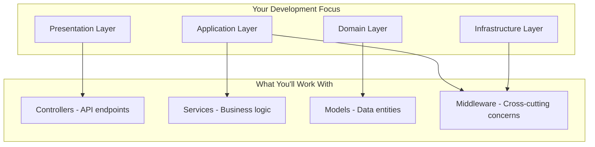
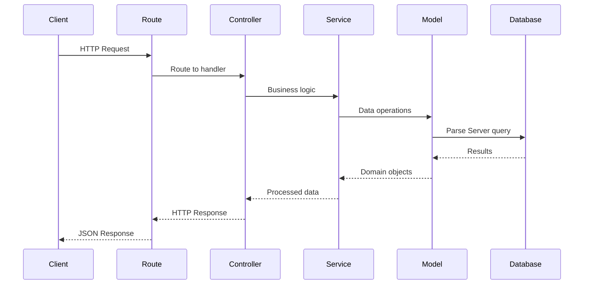
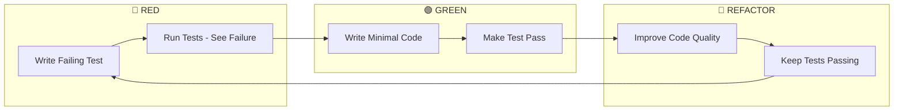

# Amexing Experience - Developer Onboarding Guide

Welcome to the **Amexing Experience** development team! This guide will get you up and running quickly with our PCI DSS compliant e-commerce platform.

## 🚀 Quick Start (5 Minutes)

### **Prerequisites Checklist**
```bash
# Check Node.js version (18.x or higher)
node --version  # Should be v18.x.x or higher

# Check Yarn installation
yarn --version  # Should be 1.22.x or higher

# Check MongoDB installation (for local development)
mongod --version  # Should be 5.0 or higher

# Check Git configuration
git config --get user.name
git config --get user.email
```

### **Initial Setup**
```bash
# 1. Clone the repository
git clone <repository-url>
cd Amexing-Experience

# 2. Install dependencies
yarn install

# 3. Set up environment
cp environments/.env.example environments/.env.development

# 4. Start development server
yarn dev

# 5. Verify installation
curl http://localhost:1337/health
```

**✅ Success Indicators:**
- Server starts on port 1337
- Health check returns `{"status": "ok"}`
- No error messages in console
- Database connection established

---

## 📋 Environment Setup

### **Development Environment**

**Required Environment Variables:**
```bash
# Core Parse Server Configuration
PARSE_APP_ID=AmexingDev
PARSE_MASTER_KEY=your_master_key_here
PARSE_SERVER_URL=http://localhost:1337/parse
DATABASE_URI=mongodb://localhost:27017/AmexingDEV

# JWT Configuration  
JWT_SECRET=your_jwt_secret_here

# External Services (Development)
AWS_ACCESS_KEY_ID=dev_key_here
AWS_SECRET_ACCESS_KEY=dev_secret_here
S3_BUCKET=amexing-bucket
S3_REGION=us-east-1

# Email Service
MAILER_SEND_API_KEY=your_mailer_key
FROM_EMAIL=dev@amexing.com

# OAuth Configuration
APPLE_CLIENT_ID=your_apple_client_id
APPLE_CLIENT_SECRET=your_apple_client_secret
```

**Database Setup:**
```bash
# Start MongoDB locally
mongod --dbpath /usr/local/var/mongodb

# Seed the database with test data
yarn seed

# Verify database setup
yarn scripts:help
```

### **VS Code Integration**

**Recommended Extensions:**
```json
{
  "recommendations": [
    "ms-vscode.vscode-jest",
    "esbenp.prettier-vscode",
    "dbaeumer.vscode-eslint", 
    "ryanluker.vscode-coverage-gutters"
  ]
}
```

**VS Code Configuration** (Auto-configured):
- **Testing**: Run/debug tests directly from editor
- **Code Quality**: Automatic linting and formatting
- **Snippets**: Pre-built test templates
- **Tasks**: One-click testing and development tasks

---

## 🏗️ Architecture Overview

### **Clean Architecture Layers**



### **Key Directories You'll Use**

| Directory | Purpose | When to Use |
|-----------|---------|-------------|
| `src/application/controllers/api/` | **API endpoints** | Adding new REST APIs |
| `src/application/services/` | **Business logic** | Complex operations |
| `src/domain/models/` | **Data models** | Database entities |
| `src/presentation/views/` | **Frontend templates** | UI components |
| `tests/integration/` | **Integration tests** | Testing complete features |
| `tests/unit/` | **Unit tests** | Testing individual functions |

### **Request Flow** (What happens when you add an endpoint)



---

## 🧪 Test-Driven Development (TDD)

### **TDD Workflow** (Our Core Development Process)



### **Test Types & When to Use**

| Test Type | Purpose | When to Use | Speed |
|-----------|---------|-------------|-------|
| **Integration** | Full feature testing | New APIs, user flows | Slow (~2 min) |
| **Unit** | Function testing | Utilities, services | Fast (~10 sec) |
| **Regression** | Prevent bugs | Before commits | Very Fast (<10 sec) |

### **Writing Your First Test**

**Step 1: Integration Test Template**
```javascript
// tests/integration/api/my-feature.test.js
const request = require('supertest');
const AuthTestHelper = require('../../helpers/authTestHelper');

describe('My Feature Integration', () => {
  let app;
  let adminToken;

  beforeAll(async () => {
    app = require('../../../src/index');
    await new Promise(resolve => setTimeout(resolve, 1000));
    adminToken = await AuthTestHelper.loginAs('admin', app);
  }, 30000);

  it('should create new resource', async () => {
    const response = await request(app)
      .post('/api/my-resource')
      .set('Authorization', `Bearer ${adminToken}`)
      .send({ name: 'Test Resource' });

    expect(response.status).toBe(201);
    expect(response.body.success).toBe(true);
    expect(response.body.data.name).toBe('Test Resource');
  });
});
```

**Step 2: Run the Test (🔴 RED)**
```bash
# This will FAIL - that's expected!
yarn test tests/integration/api/my-feature.test.js
```

**Step 3: Implement the Feature (🟢 GREEN)**
```javascript
// src/application/controllers/api/MyResourceController.js
const Parse = require('parse/node');

const MyResourceController = {
  async create(req, res) {
    try {
      const { name } = req.body;
      
      const resource = new Parse.Object('MyResource');
      resource.set('name', name);
      resource.set('active', true);
      resource.set('exists', true);
      
      await resource.save(null, { useMasterKey: true });
      
      res.json({
        success: true,
        data: resource.toJSON()
      });
    } catch (error) {
      res.status(500).json({
        success: false,
        error: error.message
      });
    }
  }
};

module.exports = MyResourceController;
```

**Step 4: Add the Route**
```javascript
// src/presentation/routes/api/myResourceRoutes.js  
const express = require('express');
const MyResourceController = require('../../application/controllers/api/MyResourceController');
const jwtMiddleware = require('../../infrastructure/security/jwtMiddleware');

const router = express.Router();

router.post('/my-resource', jwtMiddleware, MyResourceController.create);

module.exports = router;
```

**Step 5: Run Test Again (Should Pass!)**
```bash
yarn test tests/integration/api/my-feature.test.js
# ✅ Test should pass now!
```

---

## 🔐 Authentication & Security

### **Working with Authentication**

**Test Users (Always Available):**
```javascript
// Get any test user credentials
const credentials = AuthTestHelper.getCredentials('admin');
console.log(credentials);
// { email: 'test-admin@amexing.test', password: 'TestPass123!', role: 'admin' }

// Login in tests
const adminToken = await AuthTestHelper.loginAs('admin', app);

// Available roles: superadmin, admin, client, department_manager, 
//                 employee, employee_amexing, driver, guest
```

**Role-Based Access Control (RBAC):**
```javascript
// Check permissions in controllers
const PermissionService = require('../services/PermissionService');

const hasPermission = await PermissionService.checkPermission(
  user, 
  'CLIENT_CREATE'
);

if (!hasPermission) {
  return res.status(403).json({
    success: false,
    error: 'Insufficient permissions'
  });
}
```

**Security Best Practices:**
- ✅ Always validate input data
- ✅ Use JWT middleware for protected routes
- ✅ Check permissions before operations
- ✅ Log security events
- ❌ Never log sensitive data (passwords, tokens)
- ❌ Never bypass authentication in production

### **Adding Protected API Endpoints**

**Template for Secure Endpoints:**
```javascript
const express = require('express');
const jwtMiddleware = require('../../infrastructure/security/jwtMiddleware');
const PermissionService = require('../../application/services/PermissionService');

const router = express.Router();

router.post('/secure-endpoint', 
  jwtMiddleware,  // ✅ Always add JWT middleware
  async (req, res) => {
    try {
      // ✅ Check specific permissions
      const hasPermission = await PermissionService.checkPermission(
        req.user, 
        'REQUIRED_PERMISSION'
      );
      
      if (!hasPermission) {
        return res.status(403).json({
          success: false,
          error: 'Insufficient permissions'
        });
      }
      
      // Your business logic here
      
    } catch (error) {
      res.status(500).json({
        success: false,
        error: error.message
      });
    }
  }
);
```

---

## 💾 Working with Data

### **Parse Server Patterns**

**Standard Database Operations:**
```javascript
// CREATE - Always include required fields
const record = new Parse.Object('TableName');
record.set('active', true);    // ✅ Required
record.set('exists', true);    // ✅ Required
record.set('name', 'value');
await record.save(null, { useMasterKey: true });

// READ - Filter by exists and active
const query = new Parse.Query('TableName');
query.equalTo('exists', true);    // ✅ Only show visible records
query.equalTo('active', true);    // ✅ Only show active records
const results = await query.find({ useMasterKey: true });

// UPDATE - Standard update pattern
record.set('field', 'newValue');
await record.save(null, { useMasterKey: true });

// DELETE - Logical deletion only
record.set('exists', false);     // ✅ Logical delete
await record.save(null, { useMasterKey: true });
// ❌ NEVER: await record.destroy(); (Physical delete)
```

**Data Validation:**
```javascript
// Input validation example
const validateCreateUser = (data) => {
  const errors = [];
  
  if (!data.email || !data.email.includes('@')) {
    errors.push('Valid email is required');
  }
  
  if (!data.password || data.password.length < 8) {
    errors.push('Password must be at least 8 characters');
  }
  
  return errors;
};

// Use in controller
const errors = validateCreateUser(req.body);
if (errors.length > 0) {
  return res.status(400).json({
    success: false,
    error: 'Validation failed',
    details: errors
  });
}
```

### **Database Relationships**

**Common Relationship Patterns:**
```javascript
// One-to-Many: User has many Clients
const user = await new Parse.Query('User').get(userId, { useMasterKey: true });
const clientsQuery = new Parse.Query('Client');
clientsQuery.equalTo('manager', user);
const clients = await clientsQuery.find({ useMasterKey: true });

// Many-to-One: Quote belongs to Client  
const quote = new Parse.Object('Quote');
quote.set('client', clientPointer);
await quote.save(null, { useMasterKey: true });

// Include related data
const quotesQuery = new Parse.Query('Quote');
quotesQuery.include('client');  // Include client data
const quotes = await quotesQuery.find({ useMasterKey: true });
```

---

## 🎨 Frontend Development

### **Development Tools**

**Quote Services Renderer Sync:**
When working on quote services views, use the renderer sync tools to maintain consistency:
```bash
npm run check-sync    # Check renderer synchronization
npm run sync-renderer # Interactive sync wizard
```
In browser console (development mode):
```javascript
DevTools.checkRendererSync()  // Quick sync check
```
See [Renderer Sync Guide](./RENDERER_SYNC_GUIDE.md) for details.

### **Atomic Design Structure**

**Component Hierarchy:**
```
src/presentation/views/
├── atoms/           # Basic elements (buttons, inputs)
├── molecules/       # Component combinations (forms, cards)
├── organisms/       # Complex sections (headers, tables)
└── templates/       # Full page layouts
```

**Creating New Components:**

**Step 1: Create the Component**
```html
<!-- src/presentation/views/atoms/dashboard/action-button.ejs -->
<%# 
  Action Button Atom
  @param {string} text - Button text
  @param {string} action - Button action (primary, secondary, danger)
  @param {string} size - Button size (sm, md, lg)
  @param {string} icon - Icon class (optional)
  @param {string} onclick - JavaScript onclick handler (optional)
%>

<button 
  class="btn btn-<%= action %> btn-<%= size %> <%= icon ? 'd-flex align-items-center' : '' %>"
  <% if (onclick) { %>onclick="<%= onclick %>"<% } %>
>
  <% if (icon) { %>
    <i class="<%= icon %> me-2"></i>
  <% } %>
  <%= text %>
</button>
```

**Step 2: Add to Component Showcase**
```javascript
// Update src/application/controllers/dashboard/atomicController.js
dashboardComponents: [
  {
    name: 'Action Button',
    file: 'atoms/dashboard/action-button',
    params: {
      text: 'Save Changes',
      action: 'primary',
      size: 'md',
      icon: 'fas fa-save'
    }
  }
  // ... other components
]
```

**Step 3: Use in Templates**
```html
<!-- Use in any dashboard template -->
<%- include('atoms/dashboard/action-button', {
  text: 'Create New',
  action: 'primary', 
  size: 'md',
  icon: 'fas fa-plus',
  onclick: 'openCreateModal()'
}) %>
```

**Step 4: Test in Component Showcase**
Visit: `http://localhost:1337/atomic/dashboard`

### **Role-Based UI Patterns**

**Conditional Rendering by Role:**
```html
<!-- Show different content based on user role -->
<% if (user.role === 'superadmin' || user.role === 'admin') { %>
  <%- include('molecules/admin-panel') %>
<% } %>

<% if (['department_manager', 'employee'].includes(user.role)) { %>
  <%- include('molecules/department-tools') %>
<% } %>

<% if (user.role === 'client') { %>
  <%- include('molecules/client-portal') %>
<% } %>
```

**Permission-Based Actions:**
```html
<!-- Show actions based on permissions -->
<% if (user.permissions.includes('CLIENT_CREATE')) { %>
  <button onclick="openCreateClientModal()">New Client</button>
<% } %>

<% if (user.permissions.includes('CLIENT_UPDATE')) { %>
  <button onclick="editClient('<%= client.id %>')">Edit</button>
<% } %>

<% if (user.permissions.includes('CLIENT_DELETE') && client.id !== user.id) { %>
  <button onclick="deleteClient('<%= client.id %>')">Delete</button>
<% } %>
```

---

## 🔧 Development Workflow

### **Daily Development Routine**

**Morning Setup:**
```bash
# 1. Pull latest changes
git pull origin main

# 2. Install any new dependencies
yarn install

# 3. Start development server
yarn dev

# 4. Run tests to ensure everything works
yarn test:regression
```

**Feature Development:**
```bash
# 1. Create feature branch
git checkout -b feature/my-new-feature

# 2. Write failing test first (TDD)
# Create test file and write test

# 3. Run test to see it fail
yarn test tests/integration/api/my-feature.test.js

# 4. Implement feature
# Write minimal code to make test pass

# 5. Run test again to see it pass
yarn test tests/integration/api/my-feature.test.js

# 6. Refactor and improve
# Clean up code while keeping tests passing

# 7. Run full test suite
yarn test

# 8. Check code quality
yarn lint

# 9. Commit changes
git add .
git commit -m "Add my new feature"
```

**Before Push Checklist:**
```bash
# ✅ All tests pass
yarn test

# ✅ Code quality check
yarn lint

# ✅ Security check
yarn security:all

# ✅ No sensitive data in commit
git diff --cached

# ✅ Push to remote
git push origin feature/my-new-feature
```

### **Git Hooks (Automatic Quality Checks)**

**Pre-commit Hook** (Runs automatically):
- ESLint security checks
- Semgrep static security analysis
- Secret scanning
- Documentation validation

**Pre-push Hook** (Runs automatically):
- Complete test suite
- Security audit
- Changelog validation

**If hooks fail:**
```bash
# Fix ESLint issues
yarn lint:fix

# Fix formatting
yarn format

# Fix any security issues
yarn security:all

# Re-run tests
yarn test
```

### **Common Development Tasks**

**Running Tests:**
```bash
# Run all tests
yarn test

# Run specific test file
yarn test tests/integration/api/users.test.js

# Run tests in watch mode
yarn test --watch

# Run only unit tests (fast)
yarn test:unit

# Run only integration tests
yarn test:integration

# Run regression tests (very fast)
yarn test:regression
```

**Code Quality:**
```bash
# Check code quality
yarn lint

# Auto-fix linting issues
yarn lint:fix

# Format code
yarn format

# Run complete quality check
yarn quality:all
```

**Development Tools:**
```bash
# Interactive help system
yarn scripts:help

# Start with debug logging
DEBUG=parse-server:* yarn dev

# Database seeding
yarn seed

# S3 configuration check
yarn s3:verify
```

---

## 🚨 Common Issues & Solutions

### **Environment Issues**

**Issue: "Parse Server connection failed"**
```bash
# Solution 1: Check MongoDB is running
mongod --version
brew services start mongodb-community

# Solution 2: Check environment variables
cat environments/.env.development | grep DATABASE_URI

# Solution 3: Reset database
yarn seed
```

**Issue: "Port 1337 already in use"**
```bash
# Find process using port
lsof -i :1337

# Kill the process
kill -9 <PID>

# Or use different port
PORT=1338 yarn dev
```

### **Testing Issues**

**Issue: "Tests failing after database changes"**
```bash
# Integration tests use MongoDB Memory Server
# Clean up test data
yarn test tests/setup/cleanup.test.js

# Or restart test database
yarn test:integration --force-exit
```

**Issue: "Authentication tests failing"**
```bash
# Use test users from AuthTestHelper
const credentials = AuthTestHelper.getCredentials('admin');
console.log(credentials);

# Never create your own test users
// ❌ Don't do this
const testUser = await createTestUser();

// ✅ Do this instead  
const token = await AuthTestHelper.loginAs('admin', app);
```

### **Permission Issues**

**Issue: "403 Forbidden on API calls"**
```javascript
// Check user permissions
const PermissionService = require('../services/PermissionService');
const hasPermission = await PermissionService.checkPermission(
  user, 
  'REQUIRED_PERMISSION'
);
console.log('User permissions:', user.permissions);
console.log('Required permission:', 'REQUIRED_PERMISSION');
console.log('Has permission:', hasPermission);
```

**Issue: "Role not working correctly"**
```javascript
// Debug role assignment
console.log('User role:', user.role);
console.log('Available roles:', [
  'guest', 'client', 'driver', 'employee', 
  'employee_amexing', 'department_manager', 'admin', 'superadmin'
]);

// Check role hierarchy
const roleLevel = PermissionService.getRoleLevel(user.role);
console.log('Role level:', roleLevel);
```

### **Development Issues**

**Issue: "Hot reload not working"**
```bash
# Restart development server
yarn dev

# Or clear cache and restart
rm -rf node_modules/.cache
yarn dev
```

**Issue: "Slow test execution"**
```bash
# Run only unit tests (faster)
yarn test:unit

# Run regression tests (fastest)  
yarn test:regression

# Run specific test file
yarn test tests/unit/services/MyService.test.js

# Use test debugging
yarn test --verbose tests/integration/api/users.test.js
```

---

## 📚 Learning Resources

### **Platform-Specific Documentation**

| Topic | Documentation | Priority |
|-------|---------------|----------|
| **Parse Server** | https://docs.parseplatform.org/ | High |
| **Clean Architecture** | `docs/ARCHITECTURE.md` | High |
| **Security** | `docs/SECURE_DEVELOPMENT_GUIDE.md` | High |
| **Testing** | `docs/TESTING-STRATEGY.md` | Medium |
| **API Reference** | `docs/maps/API-ENDPOINTS.md` | Medium |

### **Code Examples Repository**

**Common Patterns:**
```bash
# Find examples in existing code
grep -r "AuthTestHelper" tests/
grep -r "Parse.Query" src/
grep -r "PermissionService" src/

# Study working implementations
less src/application/controllers/api/QuoteController.js
less tests/integration/api/quotes.test.js
```

### **Development Best Practices**

**Code Style Guidelines:**
- ✅ Use descriptive variable names
- ✅ Write tests before implementation (TDD)
- ✅ Keep functions small and focused
- ✅ Include error handling
- ✅ Log important events
- ❌ Don't hardcode configuration values
- ❌ Don't skip security validation
- ❌ Don't commit sensitive data

**Testing Guidelines:**
- ✅ Write integration tests for new features
- ✅ Use existing test users (AuthTestHelper)
- ✅ Test error conditions
- ✅ Keep tests independent
- ❌ Don't modify global test state
- ❌ Don't test implementation details
- ❌ Don't skip test cleanup

---

## 🎯 Your First Week Goals

### **Day 1: Setup & Exploration**
- [ ] Complete environment setup
- [ ] Run all tests successfully
- [ ] Explore component showcase (`/atomic`)
- [ ] Read architecture documentation

### **Day 2: Understanding the Codebase**
- [ ] Study one existing API controller
- [ ] Understand authentication flow
- [ ] Review RBAC permissions system
- [ ] Explore database models

### **Day 3: First Feature (TDD)**
- [ ] Write your first integration test
- [ ] Implement simple API endpoint
- [ ] Add basic frontend component
- [ ] Test end-to-end functionality

### **Day 4: Security & Quality**
- [ ] Add proper authentication to your feature
- [ ] Implement permission checking
- [ ] Run security validation
- [ ] Fix any code quality issues

### **Day 5: Integration & Documentation**
- [ ] Add your feature to the system
- [ ] Write component documentation
- [ ] Update API documentation
- [ ] Submit your first pull request

### **Success Criteria:**
- ✅ All tests pass on your machine
- ✅ You can create new features using TDD
- ✅ You understand the security model
- ✅ You can debug common issues
- ✅ Your code passes all quality checks

---

## 🤝 Getting Help

### **Team Resources**

**Code Reviews:**
- All pull requests require review
- Focus on security, testability, maintainability
- Share knowledge and best practices

**Mentorship Program:**
- Pair programming sessions
- Code review discussions  
- Architecture design sessions

### **Documentation & Support**

**Internal Documentation:**
```bash
# Complete system documentation
ls docs/
# ARCHITECTURE.md, TESTING-STRATEGY.md, etc.

# Interactive help system
yarn scripts:help

# Code examples and patterns
find src/ -name "*.js" | head -10
```

**Issue Reporting:**
- **Bugs**: Create detailed bug reports
- **Feature Requests**: Business justification required
- **Security Issues**: Report privately to security team

### **Development Community**

**Knowledge Sharing:**
- Weekly tech talks
- Architecture decision records
- Best practices documentation
- Retrospectives and improvements

---

## 🎉 Welcome to the Team!

You're now equipped with everything you need to start contributing to the Amexing Experience platform. Remember:

**Our Core Values:**
- **Security First**: Every change must maintain PCI DSS compliance
- **Quality Always**: Tests and code quality are non-negotiable  
- **Clean Architecture**: Respect architectural boundaries
- **Team Collaboration**: Share knowledge and help each other grow

**Next Steps:**
1. **Complete your first week goals**
2. **Join the development team meetings**
3. **Start contributing to the codebase**
4. **Help improve this onboarding guide**

**Questions?**
Don't hesitate to ask! The team is here to support your success and help you make meaningful contributions to our platform.

---

*Welcome aboard! Let's build amazing things together.*

---

*Last Updated: May 6, 2026*  
*Version: 1.0*  
*Created by Denisse Maldonado*