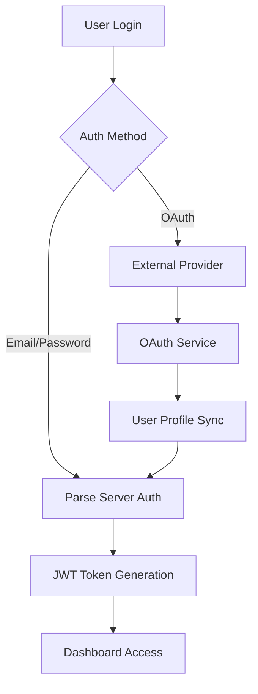
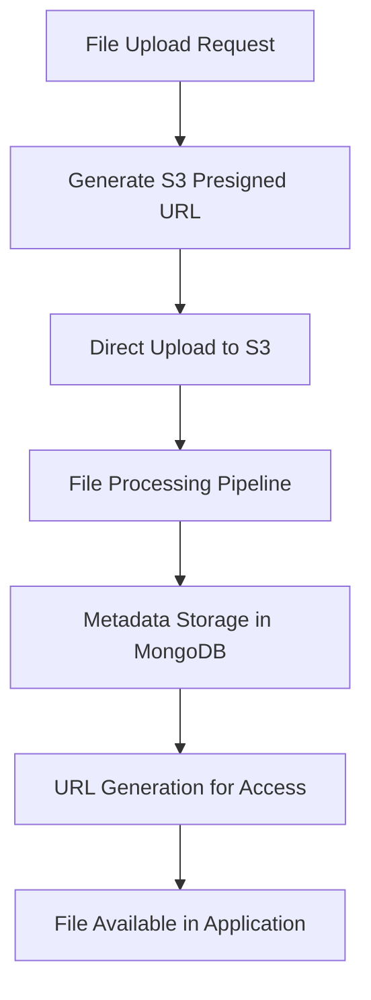
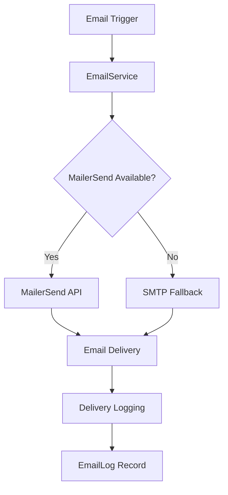

# External Services Integration Map

## Overview

This document maps all third-party services and external dependencies integrated with the Amexing Experience platform. This is part of the Phase 4 External Dependencies strategy for regression prevention.

## Table of Contents

- [1. Service Categories](#1-service-categories)
- [2. Critical External Dependencies](#2-critical-external-dependencies)
- [3. Authentication & OAuth Services](#3-authentication--oauth-services)
- [4. Communication Services](#4-communication-services)
- [5. Storage & File Services](#5-storage--file-services)
- [6. Development & Security Tools](#6-development--security-tools)
- [7. Service Health Monitoring](#7-service-health-monitoring)
- [8. Dependency Risk Analysis](#8-dependency-risk-analysis)

---

## 1. Service Categories

### External Service Classification

| Category | Services | Criticality | Impact if Down |
|----------|----------|-------------|----------------|
| **Backend-as-a-Service** | Parse Server | CRITICAL | Complete system failure |
| **Database** | MongoDB Atlas | CRITICAL | Complete data loss/access |
| **File Storage** | AWS S3 | HIGH | File upload/access failure |
| **Email Delivery** | MailerSend | HIGH | Communication breakdown |
| **Authentication** | Google OAuth | MEDIUM | OAuth login unavailable |
| **Security** | Semgrep, ESLint | MEDIUM | Security validation failure |
| **Development** | Jest, Node.js | MEDIUM | Development/testing blocked |

---

## 2. Critical External Dependencies

### Core Infrastructure Services

#### Parse Server (Backend-as-a-Service)
```javascript
Service Type: Backend-as-a-Service Platform
Criticality: CRITICAL
Version: 9.7.1
Dependencies: MongoDB, Cloud Functions

Configuration:
├── App ID: Configured per environment
├── Master Key: Environment-specific secret
├── Server URL: http://localhost:{PORT}/parse
├── Cloud Code: ./src/cloud/main.js
└── File Storage: Direct S3 integration (no adapter)

Critical Features:
├── User Authentication & Sessions
├── Database Operations & Queries  
├── Cloud Functions & Triggers
├── Real-time Queries & Subscriptions
├── Push Notifications (if configured)
└── RBAC Permission System

Failure Impact: 
- Complete system shutdown
- All database operations fail
- User authentication impossible
- Cloud functions unavailable

Health Check: GET /health (Parse Server status)
```

#### MongoDB Atlas (Primary Database)
```javascript
Service Type: Cloud Database Platform
Criticality: CRITICAL
Provider: MongoDB Inc.
Connection: mongodb+srv://... (Atlas cluster)

Configuration:
├── Database Names: AmexingDEV, AmexingPROD
├── Connection URI: Environment-specific
├── SSL/TLS: Enabled (required by Atlas)
├── Authentication: Username/password
└── Connection Pooling: Managed by Parse Server

Critical Data:
├── User accounts & authentication
├── RBAC roles & permissions
├── Business data (quotes, reservations)
├── Audit logs & compliance data
└── System configuration

Failure Impact:
- Complete data access loss
- All CRUD operations fail
- User sessions invalid
- Business operations halt

Backup Strategy: Atlas automated backups
Recovery: Parse Server auto-reconnect
```

---

## 3. Authentication & OAuth Services

### OAuth 2.0 Providers

#### Google OAuth
```javascript
Service: Google OAuth 2.0
Status: ENABLED
Provider: Google Identity Platform
Criticality: MEDIUM (alternative login method)

Configuration:
├── Client ID: GOOGLE_OAUTH_CLIENT_ID
├── Client Secret: GOOGLE_OAUTH_CLIENT_SECRET
├── Redirect URI: GOOGLE_OAUTH_REDIRECT_URI
├── Scopes: ['openid', 'profile', 'email']
└── Mock Mode: Configurable for testing

Endpoints:
├── Auth URL: https://accounts.google.com/o/oauth2/v2/auth
├── Token URL: https://oauth2.googleapis.com/token
└── User Info: https://www.googleapis.com/oauth2/v2/userinfo

Features:
├── Single Sign-On (SSO)
├── Profile Information Import
├── Email Verification
└── Corporate Domain Mapping

Failure Impact:
- OAuth login unavailable
- Users must use email/password
- Corporate SSO disrupted
- User onboarding affected

Fallback: Email/password authentication
Implementation: /src/application/services/OAuthService.js
```

#### Microsoft OAuth (DISABLED)
```javascript
Service: Microsoft OAuth 2.0
Status: DISABLED (removed from login form)
Provider: Microsoft Identity Platform
Configuration: Available but not active

Endpoints:
├── Auth URL: https://login.microsoftonline.com/common/oauth2/v2.0/authorize
├── Token URL: https://login.microsoftonline.com/common/oauth2/v2.0/token
└── User Info: https://graph.microsoft.com/v1.0/me

Notes: Disabled to simplify authentication flow
```

#### Apple OAuth (DISABLED)
```javascript
Service: Apple Sign In
Status: DISABLED (removed from login form)
Provider: Apple Identity Services
Configuration: Available but not active

Endpoints:
├── Auth URL: https://appleid.apple.com/auth/authorize
└── Token URL: https://appleid.apple.com/auth/token

Notes: Disabled to simplify authentication flow
```

### Corporate Authentication
```javascript
Service: Corporate OAuth Service
Implementation: /src/application/services/CorporateOAuthService.js
Purpose: Enterprise customer SSO integration

Features:
├── Department-based authentication
├── Corporate domain validation
├── Role mapping from corporate systems
└── Bulk user provisioning

Integration Points:
├── Domain verification
├── Role inheritance
├── Department assignment
└── Permission mapping
```

---

## 4. Communication Services

### Email Delivery

#### MailerSend (Primary)
```javascript
Service: MailerSend Email API
Criticality: HIGH
Provider: MailerSend Ltd.
Purpose: Transactional email delivery

Configuration:
├── API Token: MAILERSEND_API_TOKEN
├── From Address: noreply@quotes.amexingexperience.com
├── From Name: Amexing Experience
└── Base URL: EMAIL_BASE_URL (for assets)

Email Types:
├── User registration confirmation
├── Password reset notifications
├── Quote notifications
├── Booking confirmations
├── Invoice delivery
├── System alerts
└── Administrative notifications

Features:
├── Template-based emails
├── Delivery tracking
├── Bounce handling
├── Open/click analytics
└── PCI DSS compliance

Failure Impact:
- Email notifications stop
- Password reset unavailable
- User registration blocked
- Business communication disrupted

Fallback: SMTP configuration (legacy)
Implementation: /src/application/services/EmailService.js
Health Check: Email service status in dashboard
```

#### SMTP (Legacy Fallback)
```javascript
Service: SMTP Email Delivery
Status: Legacy fallback
Provider: Gmail SMTP
Configuration: EMAIL_HOST, EMAIL_PORT, EMAIL_USER

Notes: 
- Available as backup
- Less reliable than MailerSend
- Used only if MailerSend fails
```

---

## 5. Storage & File Services

### AWS S3 File Storage

#### Production S3 Configuration
```javascript
Service: Amazon S3
Criticality: HIGH
Provider: Amazon Web Services
Purpose: Secure file storage and delivery

Configuration:
├── Bucket: amexing-bucket
├── Region: AWS_REGION (us-east-1)
├── Prefix: prod/ (production) | dev/ (development)
├── Encryption: AES256 (PCI DSS compliant)
└── Access: IAM roles (production) | Access keys (development)

File Types:
├── Vehicle images (optimized: AVIF, WebP, JPEG)
├── Tour images and galleries
├── Experience multimedia
├── PDF receipts and invoices
├── User profile images
└── System documentation

Security Features:
├── Presigned URLs (1-hour expiry)
├── Server-side encryption (AES256)
├── Environment-based prefixes
├── IAM policy restrictions
└── PCI DSS compliance (3.5.1)

Critical Operations:
├── File upload via presigned URLs
├── Image optimization pipeline
├── PDF receipt generation
├── Invoice file storage
└── Secure file downloads

Failure Impact:
- File uploads fail
- Image display broken
- PDF generation unavailable
- Invoice delivery blocked
- User experience degraded

Monitoring:
├── S3 bucket policies
├── Access logging
├── Storage metrics
└── Cost monitoring

Implementation: /src/infrastructure/storage/
Health Check: yarn s3:verify (dev) | yarn s3:verify:prod
```

#### File Processing Pipeline
```javascript
Service: Internal Image Processing
Dependencies: Sharp.js, AWS S3
Purpose: Image optimization and format conversion

Process Flow:
1. Raw image upload to S3
2. Sharp.js processing (resize, compress)
3. Multi-format generation (AVIF, WebP, JPEG)
4. Metadata extraction and storage
5. Optimized images stored back to S3

Formats Generated:
├── AVIF (modern, high compression)
├── WebP (modern, good compression)
└── JPEG (fallback, universal support)

Implementation: /scripts/images/optimize-images.js
Triggers: Manual, batch processing
```

---

## 6. Development & Security Tools

### Security & Code Quality

#### Semgrep (Static Analysis)
```javascript
Service: Semgrep Static Security Analysis
Criticality: MEDIUM
Provider: r2c/Semgrep
Purpose: Security vulnerability detection

Configuration:
├── Rules: p/security-audit, p/javascript, p/nodejs
├── Execution: Pre-commit hooks, CI/CD
├── Blocking: security:semgrep (fails on issues)
└── Non-blocking: security:check (reports only)

Security Checks:
├── SQL injection patterns
├── XSS vulnerabilities
├── Secret exposure
├── Insecure configurations
├── OWASP Top 10 compliance
└── PCI DSS requirements

Critical Features:
├── Pre-commit validation
├── CI/CD integration
├── False positive management
└── Custom rule configuration

Failure Impact:
- Security validation blocked
- Commits may be rejected
- CI/CD pipeline failures
- Manual security review required

Implementation: Via npm scripts and git hooks
```

#### ESLint (Code Quality)
```javascript
Service: ESLint JavaScript Linting
Criticality: MEDIUM
Purpose: Code quality and style enforcement

Configuration:
├── Config: .config/eslint/eslintrc.js
├── Rules: Airbnb base + custom security rules
├── Extensions: .js files in src/
└── Complexity: .config/eslint/complexity-eslintrc.js

Quality Checks:
├── Code style consistency
├── Potential bug detection
├── Security anti-patterns
├── Complexity analysis
└── Best practices enforcement

Integration:
├── Pre-commit hooks
├── IDE integration
├── CI/CD validation
└── Auto-fixing capabilities
```

### Testing & Development

#### Jest (Testing Framework)
```javascript
Service: Jest Testing Framework
Criticality: MEDIUM
Provider: Meta (Facebook)
Purpose: Unit and integration testing

Configurations:
├── Main: .config/jest/jest.config.js
├── OAuth: .config/jest/oauth.jest.config.js
├── Components: .config/jest/components.jest.config.js
└── Parse Platform: .config/jest/parse-platform.jest.config.js

Test Environments:
├── Unit tests: Fast, no external dependencies
├── Integration tests: MongoDB Memory Server
├── OAuth tests: Mock and real provider tests
├── Security tests: PCI DSS compliance
└── Component tests: UI component validation

Dependencies:
├── MongoDB Memory Server (test database)
├── Supertest (HTTP testing)
├── Parse SDK (database operations)
└── Mock providers (OAuth testing)
```

#### Node.js Runtime
```javascript
Service: Node.js JavaScript Runtime
Version: v21+ (with experimental features)
Criticality: CRITICAL
Provider: Node.js Foundation

Required Features:
├── ES Modules (--experimental-vm-modules)
├── File watching (--watch for development)
├── Modern JavaScript features
└── NPM package management

Critical Dependencies:
├── Parse SDK compatibility
├── AWS SDK compatibility  
├── Security libraries
└── Development tools
```

---

## 7. Service Health Monitoring

### Built-in Health Checks

#### Application Health Endpoints
```javascript
Endpoint: GET /health
Purpose: Overall application health status

Checks:
├── Parse Server connectivity
├── Database connection status
├── Email service availability
├── File storage accessibility
└── System resource usage

Response Format:
{
  "status": "healthy|degraded|unhealthy",
  "timestamp": "2026-05-06T...",
  "services": {
    "parse": "healthy",
    "database": "healthy", 
    "email": "healthy",
    "storage": "healthy"
  },
  "version": "0.6.0"
}
```

#### Metrics Endpoint
```javascript
Endpoint: GET /metrics
Purpose: Detailed system metrics

Metrics Include:
├── Response times
├── Error rates  
├── Resource utilization
├── Request counts
└── Service availability

Format: JSON metrics for monitoring systems
```

### External Service Monitoring

#### S3 Verification
```javascript
Commands: yarn s3:verify (dev) | yarn s3:verify:prod
Purpose: Validate S3 configuration and connectivity

Checks:
├── Bucket accessibility
├── IAM permissions
├── Environment separation
├── Encryption settings
└── Presigned URL generation

Alerts: Configuration issues, permission problems
```

#### Email Service Status
```javascript
Monitoring: Built into EmailService class
Checks: API token validity, service availability
Fallback: Automatic SMTP fallback if MailerSend fails
Logging: All email attempts and failures logged
```

---

## 8. Dependency Risk Analysis

### High-Risk Dependencies

#### Parse Server Version Lock
```javascript
Risk Level: HIGH
Current Version: 9.7.1
Issue: Major version upgrades can break compatibility

Mitigation Strategy:
├── Pin exact version in package.json
├── Test upgrades in staging environment
├── Maintain backward compatibility
└── Review breaking changes carefully

Impact of Failure:
- Complete system rebuild required
- Cloud function compatibility issues
- Database schema migration needs
- Authentication system changes
```

#### AWS Service Dependencies
```javascript
Risk Level: HIGH
Services: S3, IAM
Issue: Service outages, configuration drift

Mitigation Strategy:
├── Multi-region backup considerations
├── IAM policy versioning
├── Regular access testing
└── Alternative storage planning

Impact of Failure:
- File operations completely blocked
- User experience severely degraded
- Business operations affected
- Revenue impact possible
```

### Medium-Risk Dependencies

#### OAuth Provider Changes
```javascript
Risk Level: MEDIUM
Providers: Google OAuth 2.0
Issue: API changes, service deprecation

Mitigation Strategy:
├── Monitor provider announcements
├── Implement multiple providers
├── Maintain email/password fallback
└── Test authentication flows regularly

Impact of Failure:
- OAuth login methods unavailable
- User onboarding affected
- Corporate SSO disrupted
- Fallback authentication required
```

#### Email Service Provider
```javascript
Risk Level: MEDIUM
Provider: MailerSend
Issue: Service outages, rate limiting

Mitigation Strategy:
├── SMTP fallback configured
├── Email queue implementation
├── Rate limit monitoring
└── Alternative providers evaluated

Impact of Failure:
- Transactional emails delayed
- User notifications missed
- Password reset unavailable
- Business communication affected
```

### Low-Risk Dependencies

#### Development Tools
```javascript
Risk Level: LOW
Tools: ESLint, Prettier, Jest
Issue: Version updates, configuration changes

Mitigation Strategy:
├── Lock versions during development cycles
├── Test tool upgrades in isolation
├── Maintain configuration backups
└── Document custom configurations

Impact of Failure:
- Development workflow disrupted
- Code quality checks disabled
- Testing capabilities reduced
- Manual quality assurance required
```

---

## Service Integration Patterns

### Authentication Flow Integration


### File Upload Integration


### Email Delivery Integration


---

## Implementation Notes

### Critical Configuration Points
```javascript
1. Environment Separation
   - Development: localhost + dev/ S3 prefix
   - Production: production domains + prod/ S3 prefix
   - Test: MongoDB Memory Server + mock services

2. Security Configuration
   - All API keys in environment variables
   - No secrets in code repository
   - PCI DSS compliant configurations
   - Encryption at rest and in transit

3. Monitoring Requirements
   - Service health endpoints implemented
   - External dependency monitoring
   - Error tracking and alerting
   - Performance metrics collection
```

### Disaster Recovery Considerations
```javascript
1. Parse Server Recovery
   - MongoDB Atlas automated backups
   - Parse Server configuration backup
   - Cloud function code in version control
   - Environment variable backup

2. File Storage Recovery
   - S3 versioning enabled (recommended)
   - Cross-region replication (future)
   - File processing pipeline recreation
   - Image optimization re-processing

3. External Service Alternatives
   - Email: SMTP fallback configured
   - OAuth: Email/password always available
   - Monitoring: Multiple health check endpoints
   - File storage: Local storage emergency fallback
```

---

*This document should be updated whenever external service integrations change. Last updated: May 2026*